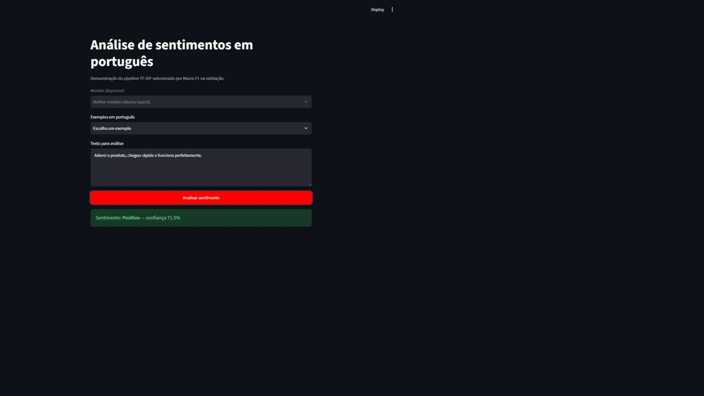
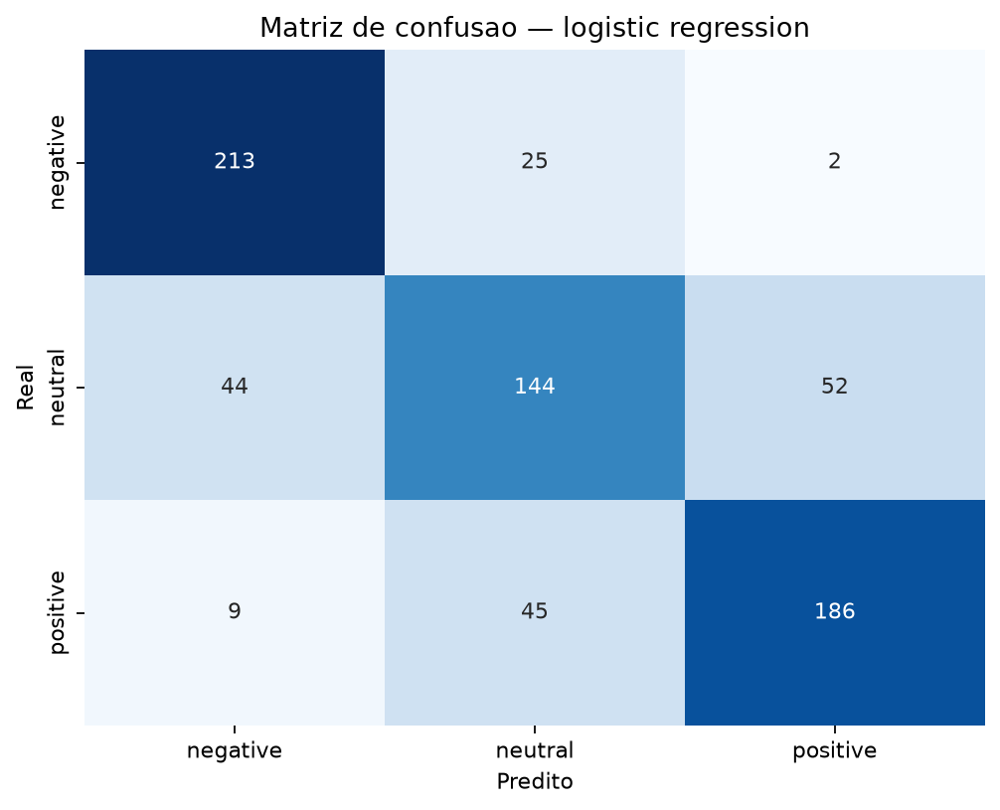
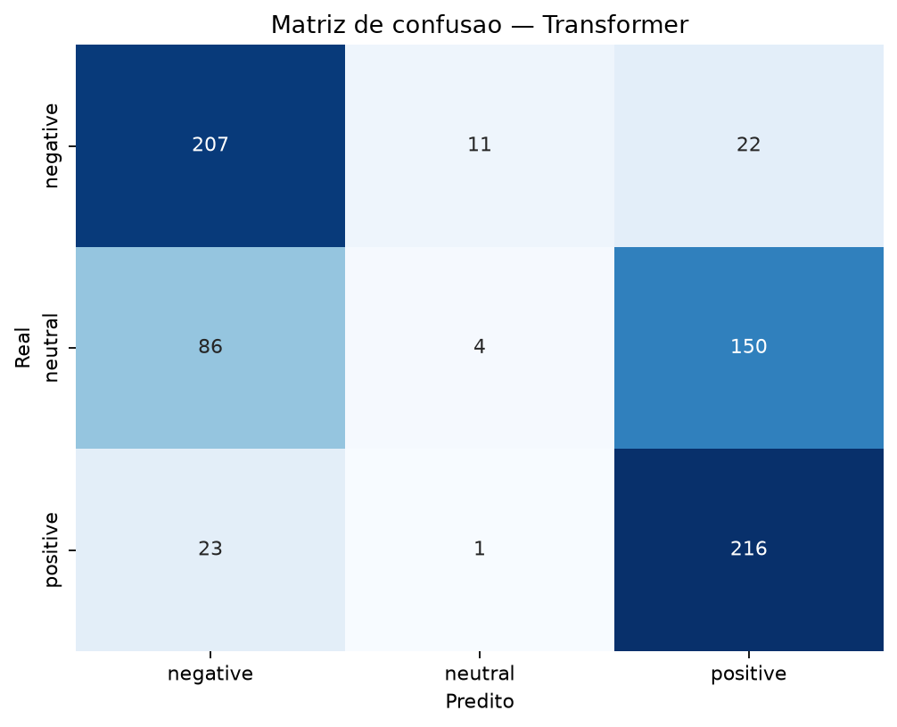

# GenAI Sentiment Analysis — português do Brasil

[](https://github.com/agathalafaiety/genai-sentiment-analysis/actions/workflows/ci.yml)
[](https://www.python.org/)
[](LICENSE)

[](https://colab.research.google.com/github/agathalafaiety/genai-sentiment-analysis/blob/main/notebooks/demo_colab.ipynb)

Estudo reproduzível de análise de sentimentos em português que compara um baseline, dois pipelines clássicos, um Transformer multilíngue e classificação GenAI zero/few-shot. O foco é o processo de Ciência de Dados: dados reais, prevenção de leakage, avaliação quantitativa, análise de erros e limitações — não apenas uma chamada de API.



## O problema

Avaliações de clientes misturam opinião sobre produto, entrega, preço e atendimento. Negação, ironia, ortografia informal e frases com aspectos positivos e negativos tornam uma classificação em três classes inerentemente imperfeita. O projeto mede o que abordagens de complexidade crescente ganham e onde falham.

## Objetivos

- Construir uma referência simples com a classe majoritária.
- Comparar TF-IDF + Regressão Logística e TF-IDF + Complement Naive Bayes.
- Medir um Transformer de três classes sem exigir fine-tuning local.
- Versionar e validar prompts GenAI zero-shot e few-shot.
- Usar Macro F1 como métrica principal e manter o teste fora da seleção.
- Oferecer modos `quick` (CPU) e `full` (Colab) e uma demo Streamlit.

## Dataset

O [B2W-Reviews01](https://github.com/americanas-tech/b2w-reviews01) contém mais de 130 mil reviews de e-commerce em português, coletadas em 2018. O download usa uma revisão Git fixada para reprodutibilidade. O corpus é **CC BY-NC-SA 4.0**, portanto seu uso é não comercial, exige atribuição à B2W Digital e não é coberto pela licença MIT do código.

Os rótulos são derivados de `overall_rating`:

| Nota | Classe |
|---:|---|
| 1–2 | `negative` |
| 3 | `neutral` |
| 4–5 | `positive` |

Essa regra é um proxy, não anotação linguística. Uma pessoa pode dar cinco estrelas e reclamar da entrega, ou três estrelas com texto positivo. Duplicatas textuais e registros vazios são removidos antes do split.

O modo `quick` amostra até 1.200 textos de cada classe. O modo `full` preserva a distribuição observada. Ambos usam split estratificado 64/16/20 para treino/validação/teste, com seed 42.

## Metodologia

```text
B2W (revisão fixada)
        │
 limpeza + rótulo por estrelas + deduplicação
        │
 split estratificado: treino ─ validação ─ teste isolado
        │                   │
        ├─ classe majoritária
        ├─ TF-IDF + Logistic Regression ─┐
        └─ TF-IDF + ComplementNB ────────┴─ seleção por Macro F1
                                            │
                                      avaliação no teste
        ├─ Transformer zero-shot ───────────┤
        └─ GenAI zero/few-shot opcional ────┘
```

O vocabulário TF-IDF é ajustado dentro do pipeline apenas no treino. Três valores simples de `C` ou `alpha` são comparados na validação; o vencedor é reajustado em treino + validação e avaliado uma única vez no teste.

O Transformer é [`lxyuan/distilbert-base-multilingual-cased-sentiments-student`](https://huggingface.co/lxyuan/distilbert-base-multilingual-cased-sentiments-student), revisão `cf991100...`, licença Apache 2.0. Ele produz `positive`, `neutral` e `negative`, mas foi destilado em outro domínio; isso permite observar *domain shift*.

## Resultados observados — modo quick

Execução realizada em Windows 11, Python 3.13.14 e CPU, sobre os mesmos 720 exemplos de teste (240 por classe). As latências representam vazão em lote dividida pelo número de itens, não o tempo de uma chamada isolada. `N/A` significa que a abordagem opcional não foi executada; não representa zero.

| Modelo | Macro F1 | Weighted F1 | Latência média | Observações |
|---|---:|---:|---:|---|
| Baseline majoritário | 0,1667 | 0,1667 | 0,0006 ms/item | Sempre prevê uma classe |
| **Regressão Logística** | **0,7504** | **0,7504** | **0,0568 ms/item** | Melhor Macro F1 de validação: 0,7596 |
| Complement Naive Bayes | 0,7262 | 0,7262 | 0,0701 ms/item | Forte em negativos; neutro mais difícil |
| Transformer | 0,4879 | 0,4879 | 51,0110 ms/item | Zero-shot; recall neutro 0,0167 |
| GenAI zero-shot | N/A | N/A | N/A | Sem provedor real executado |
| GenAI few-shot | N/A | N/A | N/A | Sem provedor real executado |

A Regressão Logística foi o melhor modelo: 75,4% de accuracy, 84,2% F1 negativo, 63,4% F1 neutro e 77,5% F1 positivo. O Transformer não ajustado ao domínio quase nunca escolheu `neutral`: 4 acertos em 240. Isso reforça que um modelo maior não substitui alinhamento de domínio e definição adequada do rótulo.

| Regressão Logística | Transformer zero-shot |
|---|---|
|  |  |

Arquivos de evidência ficam em `reports/metrics/`; a tabela consolidada está em [`reports/model_comparison.csv`](reports/model_comparison.csv). O corpus baixado apresentou SHA-256 `821fb0bf...eb2ab38`. Após limpeza e deduplicação ficaram 129.331 reviews: 79.192 positivas, 34.044 negativas e 16.095 neutras. A amostra quick balanceia deliberadamente essa distribuição.

## Análise de erros

O notebook [`05_model_comparison.ipynb`](notebooks/05_model_comparison.ipynb) lista exemplos reais em que os modelos erram ou discordam. A leitura qualitativa considera:

- avaliações mistas (“produto ótimo, entrega péssima”);
- negação e escopo da negação;
- ironia e sarcasmo;
- abreviações, caixa alta e erros ortográficos;
- texto factual rotulado pela nota;
- reviews sobre entrega/loja em vez do produto;
- diferença de domínio entre reviews e dados do Transformer.

Esses grupos são hipóteses interpretativas, não categorias anotadas no corpus.

Na execução observada, a Regressão Logística errou 177/720 textos (24,6%). Entre os casos inspecionados estavam reviews de três estrelas com elogios e ressalvas (“útil, porém…”), textos neutros pela nota mas linguisticamente muito negativos sobre atraso, negações cujo alvo não era o produto e frases curtas com pouco contexto. Esses exemplos explicam parte da confusão entre `neutral` e as classes polares sem presumir que toda divergência seja erro do modelo: o próprio proxy por estrelas contém ruído.

## Início rápido

### Windows PowerShell

```powershell
python -m venv .venv
.venv\Scripts\Activate.ps1
python -m pip install --upgrade pip
pip install -r requirements.txt
python -m sentiment_analysis.training --mode quick --prepare
streamlit run app.py
```

### macOS/Linux

```bash
python3 -m venv .venv
source .venv/bin/activate
python -m pip install --upgrade pip
pip install -r requirements.txt
python -m sentiment_analysis.training --mode quick --prepare
streamlit run app.py
```

O primeiro preparo baixa aproximadamente 47 MB da fonte oficial. Dados processados e o modelo `.joblib` ficam apenas na máquina local.

## Execução e reprodução

```bash
# Apenas preparar dados
python -m sentiment_analysis.data --mode quick
python -m sentiment_analysis.data --mode full

# Treinar e avaliar modelos clássicos
python -m sentiment_analysis.training --mode quick --prepare
python -m sentiment_analysis.training --mode full --prepare

# Consolidar tabela comparativa
python scripts/build_comparison.py --mode quick

# Transformer opcional (CPU; use --device 0 com GPU CUDA)
pip install -r requirements-transformer.txt
python -m sentiment_analysis.transformer --mode quick --device -1

# Notebooks
pip install -e .[notebooks]
jupyter lab
```

Para o estudo completo, use o [notebook no Colab](https://colab.research.google.com/github/agathalafaiety/genai-sentiment-analysis/blob/main/notebooks/demo_colab.ipynb). O fluxo clássico não precisa de GPU. Transformer e o modelo generativo local são etapas opcionais.

## GenAI opcional e segurança

Os prompts ficam em [`prompts/`](prompts/) e têm versões separadas para zero-shot e few-shot. A resposta segue o contrato:

```json
{
  "sentiment": "positive",
  "confidence": 0.91,
  "explanation": "O texto contém um elogio direto ao produto."
}
```

São validados classe, intervalo da confiança e explicação. Respostas inválidas, indisponibilidade e timeouts viram falhas controladas, e a avaliação registra cobertura válida.

Nenhuma chamada paga ocorre por padrão. Para autorizar explicitamente a OpenAI Responses API:

```bash
pip install -e .[genai]
# Configure OPENAI_API_KEY no ambiente; nunca no código ou notebook.
python scripts/evaluate_genai.py --provider openai --strategy zero_shot --limit 90
python scripts/evaluate_genai.py --provider openai --strategy few_shot --limit 90
```

O adaptador usa Structured Outputs conforme a [documentação oficial da OpenAI](https://developers.openai.com/api/reference/cli/resources/responses/methods/create). O modelo padrão fixado pode ser trocado com `OPENAI_MODEL`. Para Colab com modelo aberto, use `--provider local`; essa opção usa o [Qwen2.5-1.5B-Instruct](https://huggingface.co/Qwen/Qwen2.5-1.5B-Instruct) multilíngue (inclui português), revisão `989aa798...`, licença Apache 2.0. Ela exige GPU/memória adequadas e baixa os pesos do Hugging Face.

Mocks testam o contrato, mas nunca são incluídos como resultados científicos.

## Testes e qualidade

```bash
pip install -r requirements-dev.txt
pytest
ruff check .
ruff format --check .
```

A CI executa esses três comandos em Python 3.12 sem baixar datasets ou modelos grandes.

## Estrutura

```text
├── app.py                         # demo Streamlit
├── notebooks/                     # EDA, modelos, GenAI e comparação
├── prompts/                       # prompts versionados
├── scripts/                       # orquestração e consolidação
├── src/sentiment_analysis/        # código reutilizável
├── tests/                         # testes rápidos sem rede
├── data/                          # documentação; artefatos ignorados
├── models/                        # documentação; pesos ignorados
└── reports/                       # métricas, erros e figuras
```

## Limitações, vieses e uso responsável

- Os dados cobrem uma única plataforma, período (2018) e domínio (e-commerce).
- Notas são rótulos fracos e a classe neutra costuma ser semanticamente ambígua.
- O modo quick é artificialmente balanceado; não estima prevalência real.
- Informações demográficas do corpus não são usadas, reduzindo exposição desnecessária de atributos pessoais.
- Confiança do classificador não é garantia de correção nem calibração causal.
- Sentimento não deve ser usado sozinho para decisões de crédito, emprego, moderação punitiva ou avaliação de pessoas.
- A licença dos dados restringe uso comercial.

## Roadmap

- Fine-tuning de BERTimbau no Colab com GPU e validação cruzada temporal.
- Calibração de probabilidades e análise formal de incerteza.
- Rotulagem humana de uma amostra para medir o ruído do proxy por estrelas.
- Testes de robustez por região, categoria e tamanho de texto com revisão ética.

## Contribuição e licença

Leia [`CONTRIBUTING.md`](CONTRIBUTING.md). O código original está sob [MIT](LICENSE); B2W-Reviews01 mantém sua licença CC BY-NC-SA 4.0 e o Transformer mantém Apache 2.0.

Autoria do repositório: [agathalafaiety](https://github.com/agathalafaiety).
